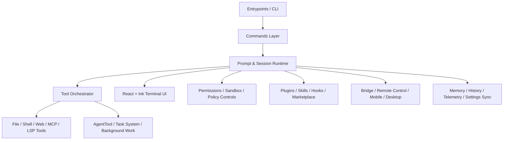

# Claude Code

**A source-first snapshot of the Claude Code `src/` tree**

*Terminal-native AI coding, tool orchestration, MCP integration, plugin loading, permission enforcement, multi-agent collaboration, and remote control infrastructure in one codebase.*

[中文](#中文说明) • [English](#english)

---

## 中文说明

### 项目简介

这个仓库保存的是 **Claude Code 项目的 `src/` 源码目录快照**，重点展示其终端 AI 编码产品在实际工程中的核心实现方式。  
从代码结构来看，它并不是一个单一职责的小工具，而是一套完整的智能编码运行时：既有命令行入口、React + Ink 终端 UI、多种工具调用链，也有插件系统、MCP 集成、多代理协作、权限治理、远程桥接、会话记忆、语音能力和大量工程化基础设施。

如果你想研究下面这些方向，这份源码很有参考价值：

- 如何把大模型能力做成真正可用的终端产品
- 如何在 CLI 中组织复杂的工具系统与权限系统
- 如何实现多代理/子代理协作与后台任务
- 如何在本地工程、远程会话、插件生态、MCP Server 之间建立统一抽象
- 如何用 TypeScript、Bun、React、Ink 构建大型终端交互应用

### 当前仓库范围

本仓库当前以 `src/` 目录为主，适合作为源码研究、结构分析和二次整理使用。

- 已同步：`src/` 全量源码
- 已补充：`README.md`
- 已排除：所有 ZIP 文件（例如 `src.zip` 不会进入版本控制）

### 代码亮点

#### 1. 终端优先的 AI 编码体验

代码中可以看到清晰的 CLI 入口与命令体系，包含大量 slash commands、终端组件、消息渲染、任务面板、状态展示和会话控制逻辑。它不是“简单调用模型 API”的脚本，而是面向真实交互场景设计的终端产品。

#### 2. 工具系统非常完整

从 `src/tools/` 和 `src/tools.ts` 可以看出，这套系统内置了丰富的工具能力，包括但不限于：

- Bash / PowerShell 执行
- 文件读取、编辑、写入
- Grep / Glob / Web Fetch / Web Search
- Todo / Task 系列工具
- MCP 资源读取
- LSP 工具
- AgentTool 多代理任务编排
- Plan / Worktree / Config 等运行控制工具

这意味着项目并不是把“工具”当作点缀，而是把工具调用当作核心操作模型。

#### 3. 多代理协作不是概念，而是工程实现

`AgentTool`、任务模块、teammate/swarm 相关代码表明，这个系统具备把任务拆分给子代理、后台代理、远程代理或隔离 worktree 代理的能力。  
这类能力对于复杂代码改造、并行执行、长任务跟踪和人机协作都非常重要。

#### 4. 权限与安全治理做得很深

从 `src/utils/permissions/`、`BashTool`、`PowerShellTool`、`filesystem.ts` 等模块可以看出，项目对危险文件、危险目录、只读命令校验、路径校验、规则系统、权限提示、自动模式边界等都有细致实现。  
这让它更接近“可部署的安全代理系统”，而不只是实验性原型。

#### 5. 插件与 MCP 生态并重

代码中同时存在成熟的插件加载器、Marketplace 逻辑、Hook 体系，以及 MCP Server 连接与资源管理逻辑。  
也就是说，这个项目不仅能扩展“命令”，还能扩展“工具、技能、Agent、资源连接方式”，生态面非常宽。

#### 6. 不止本地 CLI，还覆盖远程与多端体验

源码中可以看到对 Remote Control / Bridge、Desktop、Mobile、Slack、GitHub App、Voice、Chrome Native Host 等能力的支持痕迹。  
这说明它的设计目标并不是一个只跑在本地终端里的孤立程序，而是一个可连接多入口、多环境的智能编码平台。

### 架构速览

### 重点目录导读

| 目录 | 作用 |
| --- | --- |
| `src/entrypoints` | CLI 与运行入口 |
| `src/commands` | Slash commands 与用户交互命令体系 |
| `src/tools` | 模型可调用工具定义与执行逻辑 |
| `src/components` | 终端 UI 组件、消息视图、对话框、任务展示 |
| `src/ink` | 自定义终端渲染与交互基础设施 |
| `src/utils/permissions` | 权限规则、路径校验、安全边界 |
| `src/utils/plugins` | 插件发现、加载、验证、Marketplace |
| `src/services/mcp` | MCP 连接管理与运行时接入 |
| `src/bridge` | 远程控制与桥接能力 |
| `src/tasks` | 本地/远程/后台/多代理任务调度 |
| `src/services` | API、记忆、同步、策略、遥测等服务 |
| `src/keybindings` / `src/vim` | 键位系统与 Vim 风格交互支持 |
| `src/voice` / `src/services/voice*` | 语音输入相关能力 |

### 为什么这个仓库值得看

- 它展示了一个大型 AI CLI 产品如何真正落地，而不是停留在 Demo 阶段。
- 它把“命令、工具、权限、插件、MCP、代理、UI、远程控制”串成了统一系统。
- 它既有产品交互层，也有底层工程治理层，适合从多个视角学习。
- 它对做 AI Agent、Coding Agent、Terminal UX、Tool Use Runtime 的开发者尤其有参考价值。

### 适合谁

- 想研究 AI Coding Agent 架构的开发者
- 想实现终端 TUI 产品的工程团队
- 想搭建插件化、可控、可审计 Agent 平台的项目维护者
- 想拆解 Claude Code 类产品设计思路的学习者

### 说明

由于当前仓库以源码目录快照为主，README 会尽量忠实于已同步代码，不会虚构不存在的构建脚本、发布流程或额外资源文件。后续如果补充 `package.json`、构建配置、测试配置、示例脚本等内容，这份 README 也可以继续扩展成完整项目文档。

---

## English

### Overview

This repository is a **source-first snapshot of the Claude Code `src/` tree**, focused on the implementation details that make a serious AI coding product work inside the terminal.  
From the code layout, this is clearly more than a thin wrapper around an LLM API. It includes a substantial command system, a React + Ink terminal UI, rich tool orchestration, plugin loading, MCP connectivity, multi-agent execution, permission enforcement, remote control plumbing, memory/session infrastructure, voice-related modules, and a broad set of production-oriented utilities.

If you're interested in any of the following, this codebase is especially useful:

- building a real AI coding experience for the terminal
- designing a tool-driven agent runtime instead of a plain chat shell
- implementing multi-agent delegation and background task execution
- combining local workspace access, remote sessions, plugins, and MCP under one architecture
- scaling a TypeScript/Bun/React/Ink CLI application beyond prototype quality

### Repository Scope

This repo currently focuses on the `src/` directory and is best treated as a code snapshot for study, exploration, and future curation.

- Included: the full `src/` source tree
- Added: a curated bilingual `README.md`
- Excluded: ZIP archives of any kind, including `src.zip`

### What Makes This Codebase Interesting

#### 1. A genuine terminal-native AI product

The code shows a real CLI entrypoint, an extensive slash-command surface, interactive terminal components, task/status views, message rendering, and session lifecycle management.  
This is product-grade terminal software, not a minimal script that forwards prompts to a model.

#### 2. Tool use is treated as the core runtime model

The `src/tools/` tree and `src/tools.ts` reveal a broad built-in tool ecosystem, including:

- Bash and PowerShell execution
- file read / edit / write flows
- Grep, Glob, Web Fetch, and Web Search
- Todo and task-management tools
- MCP resource access
- LSP-assisted tooling
- AgentTool for delegated execution
- plan/worktree/config/runtime control tools

That breadth makes the architecture especially compelling for anyone designing tool-using coding agents.

#### 3. Multi-agent execution is deeply engineered

The presence of `AgentTool`, task abstractions, teammate/swarm logic, background execution, isolated worktrees, and remote agent flows suggests a system built to split, schedule, and supervise complex work rather than merely talk about delegation conceptually.

#### 4. Safety and permissions are first-class concerns

The permission-related modules indicate serious investment in path validation, dangerous file and directory protection, shell command classification, rule-based access control, approval UX, and bounded automation modes.  
That makes the repository particularly valuable for developers thinking about safe agent deployment in local environments.

#### 5. Extensibility spans both plugins and MCP

This codebase supports plugin discovery/loading, marketplace-facing plugin workflows, hooks, custom commands, and MCP server connectivity/resource access.  
In other words, extensibility here is not limited to "add a command"; it reaches into tools, skills, agents, resources, and operational integrations.

#### 6. The design goes beyond a local CLI

There are clear signs of support for remote control / bridge flows, desktop and mobile touchpoints, Slack and GitHub integrations, voice-related capabilities, and browser/native-host connections.  
That gives the repository the shape of a broader intelligent coding platform, not just an isolated command-line app.

### Architecture At A Glance

### Key Directories

| Directory | Purpose |
| --- | --- |
| `src/entrypoints` | CLI and runtime entrypoints |
| `src/commands` | Slash commands and user-facing command handlers |
| `src/tools` | Model-invocable tool definitions and execution layers |
| `src/components` | Terminal UI, dialogs, task views, and message rendering |
| `src/ink` | Terminal rendering and interaction infrastructure |
| `src/utils/permissions` | Permission rules, path validation, safety controls |
| `src/utils/plugins` | Plugin discovery, loading, validation, marketplace logic |
| `src/services/mcp` | MCP connectivity and runtime integration |
| `src/bridge` | Remote control and bridge subsystems |
| `src/tasks` | Local, remote, background, and agent task scheduling |
| `src/services` | API, memory, sync, policy, telemetry, and operational services |
| `src/keybindings` / `src/vim` | Keyboard system and Vim-style interaction support |
| `src/voice` / `src/services/voice*` | Voice-related capabilities |

### Snapshot Highlights

- `1902` source files are present in the current `src/` snapshot.
- `86` command directories are available under `src/commands`.
- `42` tool directories are available under `src/tools`.
- The code strongly indicates usage of TypeScript, Bun, React, and Ink.
- The architecture spans command handling, tool execution, UI rendering, plugins, MCP, permissions, and remote workflows.

### Why It Matters

- It shows how an AI coding interface can be structured as a full software platform.
- It connects UX, orchestration, security, and extensibility in one implementation.
- It is useful both for product thinking and for systems-level engineering study.
- It is especially relevant for builders working on coding agents, local AI tooling, terminal UX, plugin platforms, and safe tool invocation.

### Audience

- developers studying AI coding agent architecture
- teams building sophisticated terminal-first products
- maintainers designing auditable, extensible, tool-using agents
- engineers reverse-engineering the structure of products similar to Claude Code

### Final Note

This README intentionally stays faithful to the material currently tracked in the repository. Since the repo is presently centered on the `src/` tree, it does not invent missing build scripts, release tooling, or packaging metadata. As the repository grows, this document can evolve into a fuller project manual.
